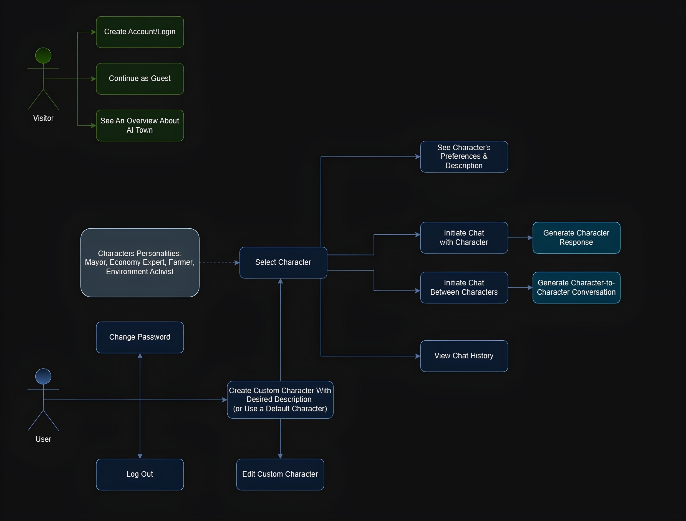
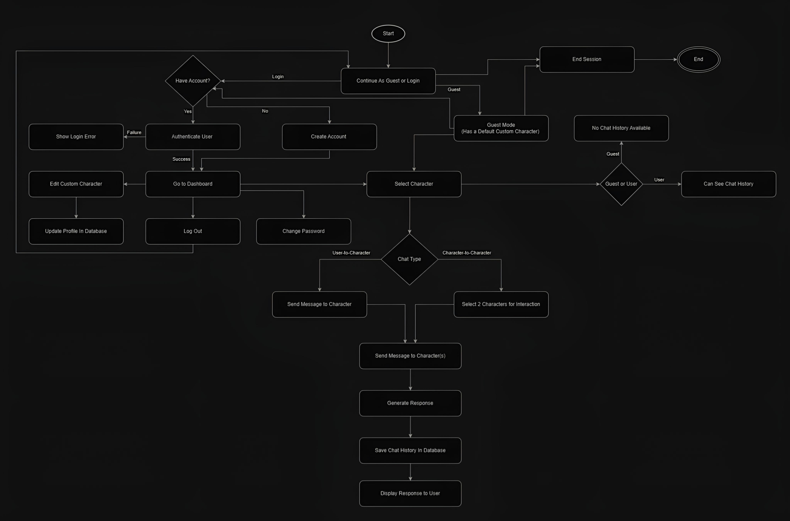

# AIrium
A project focused on enabling users to interact with AI-based characters and facilitate interactions between characters, with functionalities for chat history and character profile management.

## Table of Contents
- [Class Diagram](#class-diagram)
- [Use Case Diagram](#use-case-diagram)
- [Activity Diagram](#use-case-diagram)
- [Installation](#installation)
---

## Class Diagram
Here’s an overview of the structure and relationships between classes in this project:

---

## Use Case Diagram
The following use case diagram illustrates the primary actions a visitor and a user can perform in the system:

---

## Activity Diagram
The following activity diagram depicts the workflow of user interactions within the system:

---

## Installation
Instructions for setting up the project on your local machine: