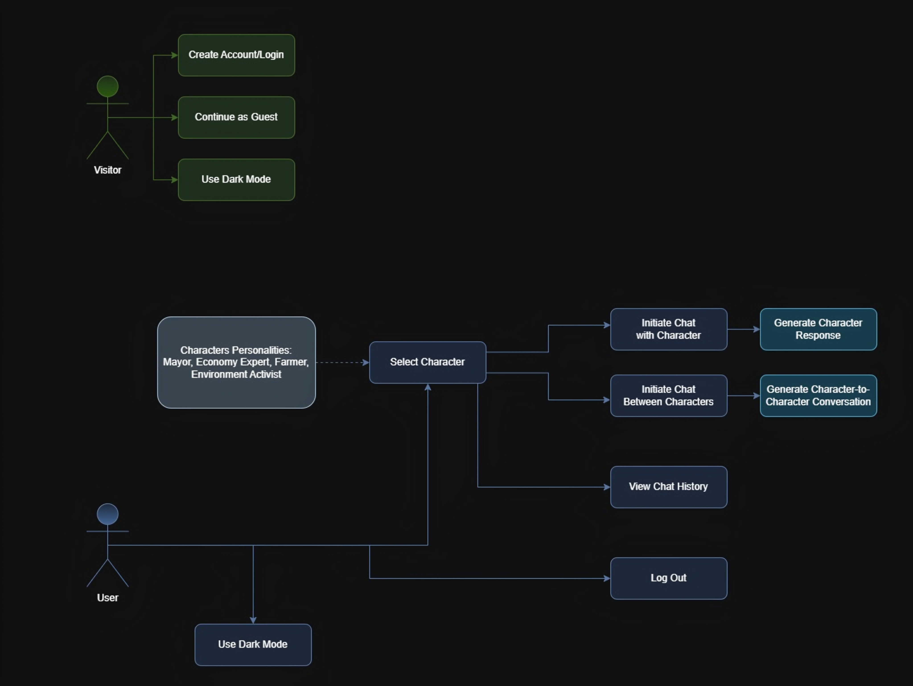

# AIrium
A project focused on enabling users to interact with AI-based characters and facilitate interactions between characters, with functionalities for chat history and character profile management.

## Table of Contents
- [Class Diagram](#class-diagram)
- [Use Case Diagram](#use-case-diagram)
- [Activity Diagram](#activity-diagram)
- [Installation](#installation)
---

## Class Diagram
Here’s an overview of the structure and relationships between classes in this project:


---

## Use Case Diagram
The following use case diagram illustrates the primary actions a visitor and a user can perform in the system:



---

## Activity Diagram
The following activity diagram depicts the workflow of user interactions within the system:


---

## Installation
Instructions for setting up the project on your local machine after cloning the repository:
1. **Install Required Packages:**
   ```bash
   pip install -r requirements.txt
   ```

2. **Set Up Environment Variables:**
   - Create a `.env` file in the root directory of the project and add your API key from a desired platform for LLMs:
     ```
     API_KEY=your_api_key_here
     ```

3. **Run Database Migrations:**
   ```bash
   python manage.py migrate
   ```


4. **Run the Development Server:**
   ```bash
   python manage.py runserver
   ```

5. **Access the Application:**
   Open your web browser and go to `http://127.0.0.1:8000/`.

## Additional Notes
- Ensure you have the necessary dependencies listed in `requirements.txt`.
- Modify the `ALLOWED_HOSTS` in `settings.py` as needed for production.

